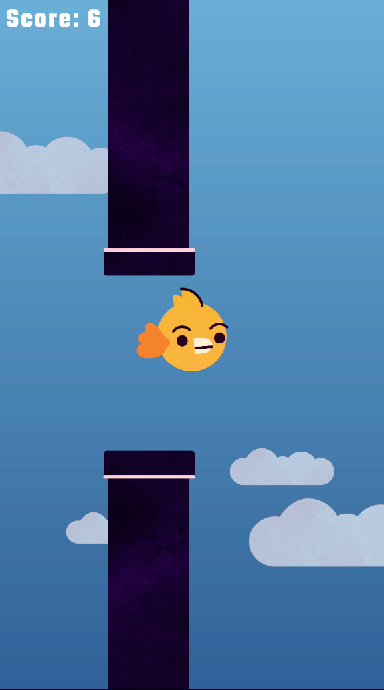
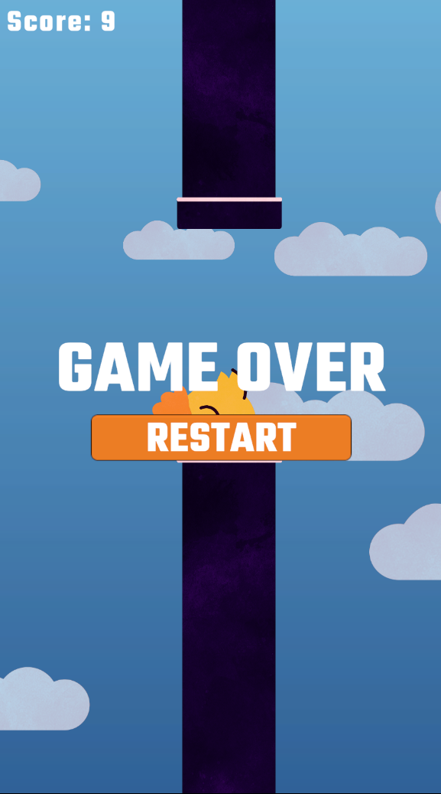

# Tapping Bird
Flappy Bird parody - Unity - 2D Game

## About
This is my first game project with Unity Engine, i learn how to build this game from this Youtube Channel 
<a href="https://youtu.be/XtQMytORBmM?si=T7UK217ikeq1ev-H">

# Screenshoot
## Windows

## Android

# Icon

# Download
Github : ["Windows"](https://github.com/RaydenDevs/TappingBird/blob/main/TappingBird_Win) (Setup) 
Github : ["Android"](https://github.com/RaydenDevs/TappingBird/tree/main/TappingBird_Apk) 
Patreon: ["Android & Windows"](https://www.patreon.com/posts/150486747)

## Note
I may update this game, but wait until i'm pro to use Unity :v

# Game Engine
## Unity 6.2

# Profile
["Github"](https://github.com/RaydenDevs)
["Website"](https://www.raydenviz.my.id)
