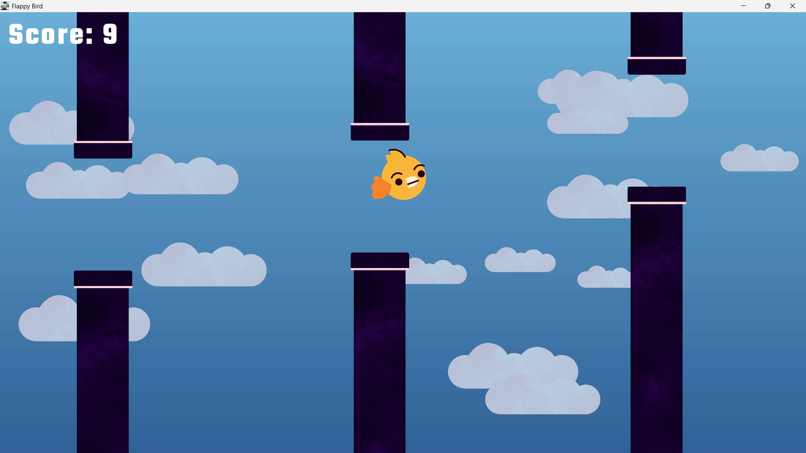
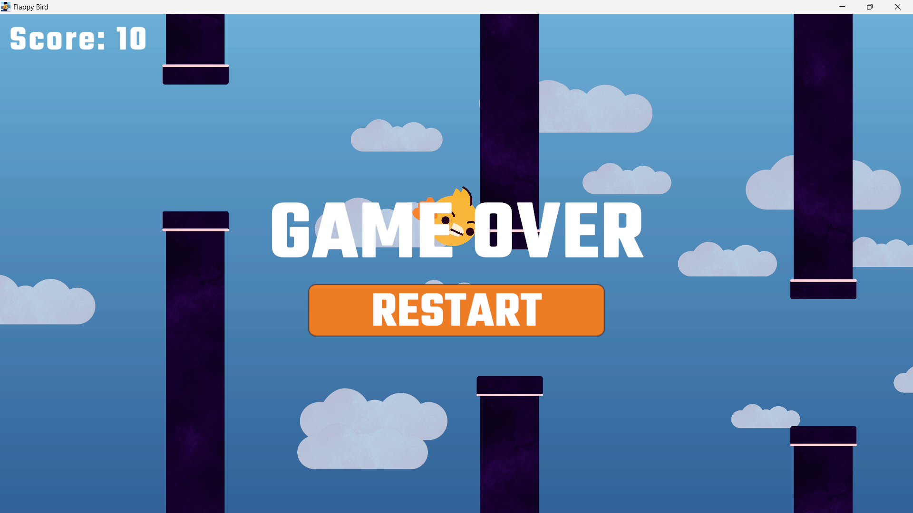

## Tapping Bird
Flappy Bird parody - Unity

# About
This is my first game project with Unity Engine, i learn how to build a game from 

## Screenshoot
# Windows

# Android

# Download
["Android"](https://www.mediafire.com/file/25vp3u60w1uvpnc/TappingBird.apk/file)

# Note
I may update this game, but wait until i'm pro to use Unity :v

## Game Engine
# Unity 6.3
["Unity"](https://1000logos.net/wp-content/uploads/2021/10/Unity-logo.png)

## Profile
["Github"](https://github.com/RaydenDevs)
["Website"](raydenviz.my.id)
